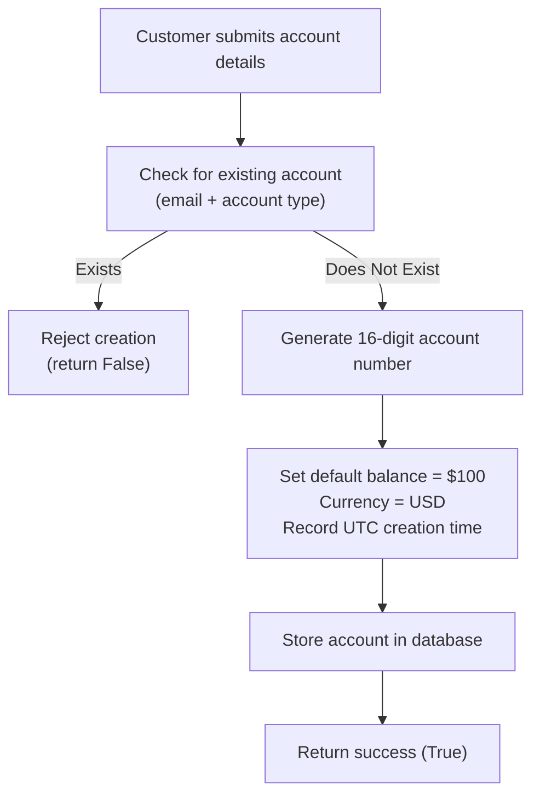
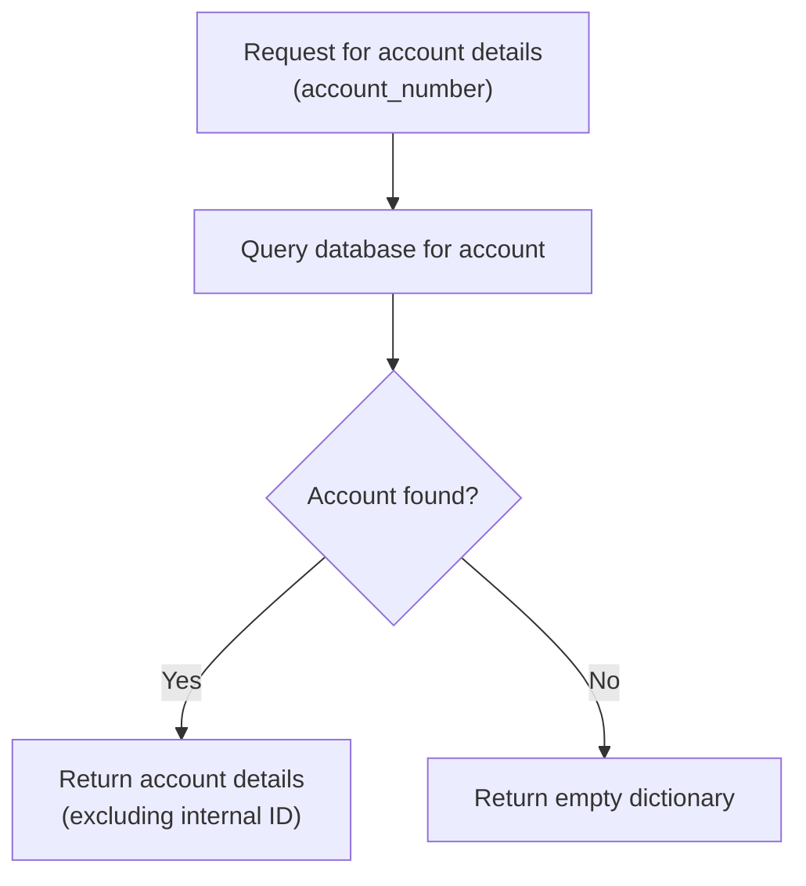
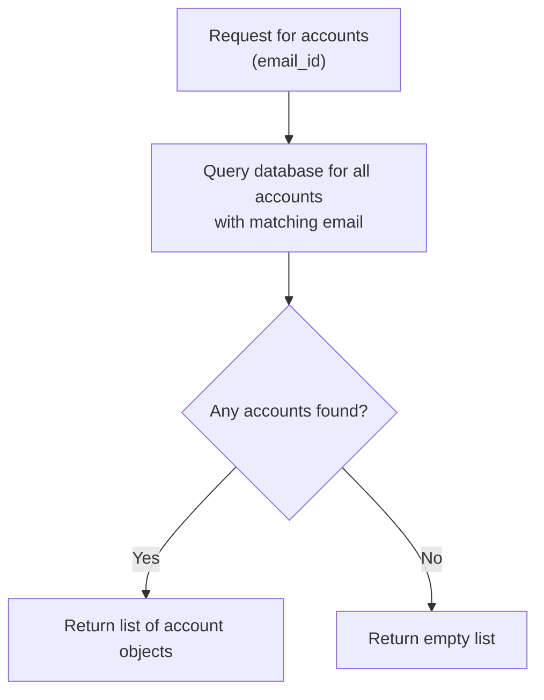

# Resource: martian-bank  
# Business Logic Analysis

## Business Purpose
This system supports core banking operations for a financial institution named Martian Bank, enabling customer account creation, retrieval, and management. It serves as the foundation for onboarding new customers and maintaining their account identities, with potential integration into broader financial services such as transactions, loans, and ATM access. The system is designed to be accessed both through internal services (via gRPC) and external clients (via REST), indicating a hybrid architecture aimed at flexibility in deployment and consumption.

## Key Business Concepts
- **Account**: A financial relationship between a customer and the bank, representing ownership and balance. Each account is uniquely identified and tied to a customer’s personal information.
- **Customer Identity**: Personal details including name, address, government-issued ID, and email used to establish and verify a customer's profile during account creation.
- **Account Number**: A unique 16-digit identifier assigned to each account upon successful creation, used for referencing and retrieving account data.
- **Account Type**: A classification of the account (e.g., checking, savings), which, when combined with email, ensures uniqueness in account creation.
- **Account Balance**: The monetary value held in the account, initialized at $100 USD upon creation.
- **Account Creation**: The process by which a new account is established, involving validation of uniqueness and population of default values.

## Business Rules
- An account must be created with a unique combination of customer email and account type; duplicate combinations are not allowed.
- All new accounts are initialized with a default balance of $100 USD.
- Account numbers are 16-digit numeric strings, randomly generated at creation time.
- Every account is timestamped at creation using UTC time.
- Government ID number and email address are collected during account creation but are stored without encryption.
- If a duplicate account (same email and account type) is attempted, the system rejects the request silently by returning a failure indicator without explaining the reason.
- The system does not validate the format of input data (e.g., email syntax, ID length, or account type validity).
- Only one currency (USD) is supported; all balances are denominated in US dollars.

## Business Process: Account Creation
### Purpose
To onboard a new customer by creating a bank account with initial funding and storing their identity information for future reference.

### Process Flow Diagram

### Workflow
1. The customer provides personal information (name, address, email, government ID) and selects an account type.
2. The system checks whether an account already exists with the same email and account type.
3. If a matching account is found, the creation process is rejected, and the system returns `False` without further explanation.
4. If no match is found:
   - A 16-digit numeric account number is randomly generated.
   - The account balance is set to $100 USD.
   - The currency is fixed as USD.
   - A creation timestamp is recorded in UTC.
   - The account record is inserted into the database.
5. Upon successful insertion, the system returns `True` to indicate success.

### Decision Points
- **Is there an existing account with the same email and account type?**
  - Yes → Reject creation silently.
  - No → Proceed with account creation.

### Business Constraints
- Duplicate accounts (same email + account type) are not permitted.
- No input validation is performed on email format, government ID, or other fields.
- No feedback is provided to the user when creation fails due to duplication.
- All accounts are created with a fixed initial balance and currency.
- Account numbers are not sequential or derived from any business logic—they are randomly generated.

## Business Process: Retrieve Account by Number
### Purpose
To allow authorized systems or users to access detailed information about a specific account using its unique account number.

### Process Flow Diagram

### Workflow
1. A request is made with a specific account number.
2. The system queries the database for a matching record.
3. If found, the account details are returned (excluding the internal database identifier).
4. If not found, an empty dictionary is returned, with no error message or status code.

### Decision Points
- **Was an account found with the provided account number?**
  - Yes → Return account details.
  - No → Return empty result.

### Business Constraints
- No authentication or authorization check is performed before retrieval.
- No audit trail is created when an account is accessed.
- The internal `_id` field is excluded from the response.

## Business Process: List Accounts by Email
### Purpose
To retrieve all accounts associated with a given customer email address, supporting customer service or self-service views of account holdings.

### Process Flow Diagram

### Workflow
1. A request is made with a customer’s email address.
2. The system retrieves all accounts linked to that email.
3. If accounts exist, they are returned as a list (excluding internal IDs).
4. If no accounts are found, an empty list is returned.

### Decision Points
- **Are there any accounts associated with the provided email?**
  - Yes → Return list of accounts.
  - No → Return empty list.

### Business Constraints
- No validation is performed on the email format.
- No access control is enforced—any caller can request accounts by email.
- Results include sensitive data (e.g., government ID) without masking.

## Edge Cases & Special Handling
- **Duplicate Account Attempt**: When a customer tries to create a second account with the same email and account type, the system fails silently, returning `False` without indicating the cause. This could lead to user confusion and repeated failed attempts.
- **Invalid Input Data**: The system accepts malformed or invalid data (e.g., non-email strings, short government IDs) without rejection, potentially leading to poor data quality.
- **Missing Account Lookup**: When retrieving an account by number that does not exist, the system returns an empty dictionary instead of an error, making it difficult for callers to distinguish between "not found" and "system error."
- **No Account Closure or Deletion**: There is no observable functionality for closing or deleting accounts, suggesting accounts are permanent once created.
- **Single Currency Limitation**: The system only supports USD, limiting its use in international contexts.

## Uncertainty Notes
- [INFORMATION GAP: Unable to determine supported account types] — It is unclear what account types (e.g., checking, savings) are valid, as no validation or enumeration is present.
- [INFORMATION GAP: No insight into security or compliance] — The system stores sensitive data (email, government ID) without encryption and lacks authentication, suggesting it may be a prototype or development environment.
- [INFORMATION GAP: No error handling details] — The system returns boolean success/failure indicators but provides no detailed error codes or messages for debugging or user feedback.
- [INFORMATION GAP: No integration with transaction processing] — While the `transactions` folder exists, there is no evidence of how account balances are updated after creation.
- [INFORMATION GAP: No lifecycle management] — There is no indication of how accounts are deactivated, frozen, or closed, if at all.
- [INFORMATION GAP: No audit or logging for data access] — While some debug logs exist, there is no evidence of comprehensive audit trails for compliance purposes.
- [INCOMPLETE: Insufficient data to determine UI or customer-facing flows] — The `ui` folder exists but contains no content, so it is unknown how customers interact with these processes.
- [INCOMPLETE: Insufficient data to determine external integrations] — Components like `integrations`, `atm-locator`, and `loan` are present but lack implementation details, so their relationship to account management is speculative.